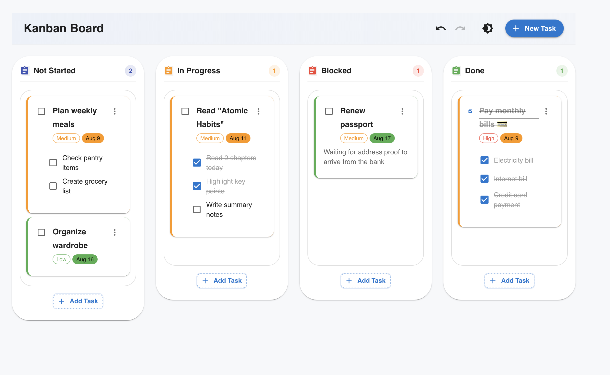
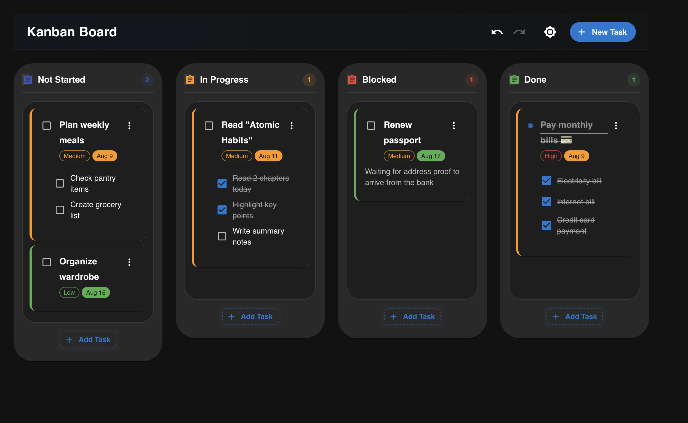

# Minimalist Kanban Board

A modern, minimalist Kanban board application built with React, TypeScript, and Material UI. This interactive task management tool helps you visualize and organize your workflow with an elegant, animation-rich interface.

## Screenshots

### Light Mode


### Dark Mode


## Features

- **Intuitive Drag and Drop**: Effortlessly move tasks between columns using React Beautiful DnD
- **Task Management**: Create, edit, and delete tasks with a simple interface
- **Subtasks**: Break down complex tasks into smaller, manageable subtasks
- **Priority Levels**: Assign priority to tasks with color-coded indicators
- **Due Dates**: Set and visualize deadlines with color-coded indicators
- **Task Completion**: Mark tasks and subtasks as complete with visual feedback
- **Automatic Task Completion**: Tasks are automatically marked as completed when all subtasks are done
- **Done Column Auto-Complete**: Tasks in the Done column are automatically marked as completed
- **Dark/Light Mode**: Toggle between themes with persistent preference
- **Undo/Redo**: Recover from accidental changes with undo/redo functionality
- **Responsive Design**: Works seamlessly across desktop and tablet devices
- **Local Storage**: Automatically saves your board state to local storage
- **Rich Animations**: Smooth animations and transitions for a polished user experience

## Technology Stack

- **React 18** with TypeScript
- **Material UI v5**: Modern component library
- **React Beautiful DnD**: Drag and drop functionality
- **React Context API**: State management
- **Custom Hooks**: useLocalStorage, useUndoableState
- **Web Animation API**: For rich interactive animations

## Getting Started

### Prerequisites

- Node.js (v16 or later)
- npm or yarn

### Installation

1. Clone the repository:
```bash
git clone https://github.com/yourusername/minimalist-kanban.git
cd minimalist-kanban
```

2. Install dependencies:
```bash
npm install
# or
yarn
```

3. Start the development server:
```bash
npm run dev
# or
yarn dev
```

4. Open your browser and navigate to `http://localhost:5173`

## Usage

- **Create a Task**: Click the "Add Task" button in any column
- **Edit a Task**: Click the edit icon on any task card
- **Delete a Task**: Click the delete icon in the task menu
- **Move a Task**: Drag and drop tasks between columns
- **Complete a Task**: Click the checkbox on a task or subtask
- **Change Theme**: Click the theme toggle button in the top right corner
- **Undo/Redo**: Use the undo/redo buttons or keyboard shortcuts (Ctrl+Z, Ctrl+Y)

## Project Structure

```
src/
├── components/        # React components
├── hooks/             # Custom React hooks
├── styles/            # Theme and style definitions
├── types/             # TypeScript type definitions
└── utils/             # Utility functions
```

## Customization

You can customize the Kanban board columns by editing the initial data in `src/components/KanbanBoard.tsx`.

## Assumptions Made

1. **User Environment**: The application assumes the user is using a modern browser that supports modern CSS features and the Web Animation API.

2. **Data Persistence**: Currently, the app uses local storage for data persistence. In a production environment, you might want to connect to a backend API.

3. **Mobile Support**: The UI is responsive but optimized primarily for desktop/tablet use.

4. **Task Automation**: Tasks are automatically marked as completed when:
   - All subtasks are completed
   - A task is moved to the "Done" column
   - A new task is created directly in the "Done" column
   
## GitHub Repository Instructions

### Setting up a Private Repository

1. Go to GitHub and create a new private repository
2. Initialize the repository with the existing code:

```bash
# Navigate to your project directory
cd /Users/pratiksb/Kanban-Board

# Initialize git if not already done
git init

# Add all files to git
git add .

# Make the initial commit
git commit -m "Initial commit: Minimalist Kanban Board implementation"

# Add the remote repository (replace with your GitHub URL)
git remote add origin https://github.com/yourusername/minimalist-kanban.git

# Push to GitHub
git push -u origin main
```

3. Give access to `@okarin1511` from the GitHub repository settings
4. In the repository settings:
   - Go to "Manage access"
   - Click "Invite a collaborator"
   - Search for `okarin1511`
   - Add as collaborator
